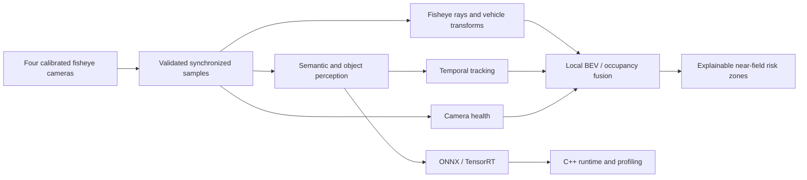

# NearField360

**Real-Time Multi-Camera Surround-View Perception for Automated Parking**

[](https://github.com/Mohamed-ahmed-shokry/nearfield360/actions/workflows/ci.yml)
[](https://www.python.org/)
[](LICENSE)

NearField360 is an engineering-focused computer vision system for calibrated automotive
fisheye cameras. Its target pipeline combines semantic perception, dynamic-object tracking,
camera-health awareness, and transparent geometric fusion into a local bird's-eye-view
representation around a vehicle.

The repository provides a reproducible, tested foundation: a WoodScape data layer, explicit
fisheye/vehicle geometry with ground-plane and BEV scaffolding, label-space perception
metrics, and inspection CLIs. Accuracy, latency, and FPS are deliberately not reported until
the corresponding experiments have run.

## Capability status

| Area | Status | Evidence |
| --- | --- | --- |
| Reproducible Python package | Implemented | Locked uv environment; wheel and sdist isolated-install smokes |
| Typed configuration and logging | Implemented | Strict validation, environment overrides, human/JSON logs; geometry and BEV sections |
| CLI and environment diagnostics | Implemented | `config validate`, `config show`, `doctor`, `geometry`, `data`, `occupancy`, and `robustness` commands |
| Integrated four-camera pipeline | Implemented | `nearfield360 pipeline run` with per-stage timings, FPS, health-aware fusion, tracking, risk, and occupancy PNG |
| Release readiness audit | Implemented | `nearfield360 release audit` verifying license, version consistency, default config, and CLI surface |
| Automated quality gates | Implemented | Ruff, strict mypy, pytest coverage, pre-commit, cross-platform CI |
| WoodScape data layer | Implemented core | Discovery, bounded readers, semantic/calibration/detection contracts, integrity, statistics, explicit-group splits, semantic overlays; synthetic tests |
| Fisheye calibration and geometry | Implemented core | Fourth-order radial projection/inverse, rigid transforms, vehicle cameras, surround rig, ground intersection, BEV grid; synthetic tests |
| Segmentation and detection metrics | Implemented foundation | Numpy-only confusion/IoU and XYXY box IoU without models or accelerators |
| BEV occupancy and risk | Implemented | Multi-camera surround fusion (`--all-cameras`), Bayesian uncertainty propagation, 360-degree parking zones (corridors/clearance/circles), occupancy & uncertainty rendering |
| Controlled robustness evaluation | Implemented | Synthetic sensor corruptions (soiling, fog, noise, rain), extrinsic calibration perturbation engine, quantitative metrics (occupancy MAE, IoU, risk error), SVG/PNG charts, interactive HTML report dashboard |
| Dynamic obstacle tracking and forecasting | Implemented core | 2D-to-3D ground footprint projection, 2D metric Kalman filter, state lifecycle, forward trajectory forecasting, collision TTC ingress, and BEV visual overlays |
| Camera health monitoring and discounting | Implemented core | Laplacian blur variance, adaptive high-frequency lens soiling detection, blockage/underexposure detection, and health-aware Bayesian evidence discounting (`--health-aware`) |
| Modular ONNX perception runtime & inference engines | Implemented | OpenCV DNN backend, letterboxing/normalization, semantic segmentation & object detection engines, numerical parity verification, latency benchmarking, and live pipeline integration |
| PyTorch training & native TensorRT/C++ accelerators | Planned | No proprietary training checkpoints or CUDA toolchains assumed; pure ONNX and OpenCV DNN execution |

## System design



The design keeps raw fisheye imagery whenever possible. It does not assume that rectilinear
undistortion can preserve a field of view greater than 180 degrees, and it does not infer metric
3D structure without a documented geometric or learned assumption.

Vehicle axes are X forward, Y left, and Z up. Camera axes are X right, Y down, and Z forward.
The ground plane is `Z == ground_z` (default zero). Pixels alone never determine depth: the
geometry layer returns unit rays and, with an explicit ground assumption, footprints with
Euclidean distances. Rays without a forward intersection stay unknown. The BEV grid covers
`[x_min, x_max) x [y_min, y_max)` with square cells and half-open bounds, matching the
fisheye image-bounds convention.

## Quick start

[uv](https://docs.astral.sh/uv/) is the supported environment manager. The project pins Python
3.12 for development and CI also verifies Python 3.11 and 3.13.

```powershell
git clone git@github.com:Mohamed-ahmed-shokry/nearfield360.git
Set-Location nearfield360
uv sync --locked --group dev
uv run nearfield360 --version
uv run nearfield360 doctor
```

The same commands work in POSIX shells after replacing `Set-Location` with `cd`.

### Configuration

Validate the repository defaults and inspect the effective settings:

```powershell
uv run nearfield360 --config configs/default.yaml config validate
uv run nearfield360 config show
```

Environment variables use the `NEARFIELD360_` prefix and `__` for nested fields. Environment
values override YAML values:

```powershell
$env:NEARFIELD360_PATHS__DATASET_ROOT = "D:\datasets\woodscape"
$env:NEARFIELD360_GEOMETRY__THETA_MAX = "2.2"
$env:NEARFIELD360_BEV__RESOLUTION = "0.05"
uv run nearfield360 config show
```

`configs/default.yaml` documents the geometry angular limit (`geometry.theta_max`), the ground
plane (`geometry.ground_z`), the footprint range gate (`geometry.max_distance`), the local
BEV extent (`bev.x_min/x_max/y_min/y_max/resolution`), the occupancy policy
(`occupancy.free_classes`/`occupied_classes`/`confidence_slope`/`min_evidence`), and the risk
filter (`risk.front_length`/`half_width`/`start_x`/`rear_length`/`rear_start_x`/`lateral_width`/
`vehicle_x_min`/`vehicle_x_max`/`near_radius`/`warning_radius`/`danger_occupancy`), and the robustness
benchmark settings (`robustness.severities`/`seed`/`rotation_perturbations_deg`/
`translation_perturbations_m`). Older configuration files without these sections continue to load with
these defaults.

Relative paths are interpreted from the process working directory. Dataset presence is not
required for `--help`, `--version`, configuration validation, or the test suite.

### Geometry inspection

Validate a per-image calibration and map pixels to ground footprints without inferring depth:

```powershell
uv run nearfield360 geometry info --calibration D:\datasets\woodscape\calibration_data\00001_FV.json --json
uv run nearfield360 geometry ground --calibration D:\datasets\woodscape\calibration_data\00001_FV.json --pixel 640,480 --pixel 800,480 --json
uv run nearfield360 geometry bev --json
```

`--theta-max` overrides the configured angular limit; `--check-bounds/--ignore-bounds` toggles
the half-open image rectangle. Invalid rays and intersections behind the ray origin report as
unknown rather than extrapolated footprints.

### Occupancy fusion and risk

Fuse semantic-grounded frames into a local bird's-eye-view occupancy layer and evaluate
configured safety zones. Supports single-camera inspection or synchronized surround fusion
(`--all-cameras` combining front, rear, left, and right cameras). Only pixels whose semantic
class votes free or occupied are rasterized; each measurement is weighted by
`1 / (1 + confidence_slope * distance)` so distant observations contribute less. Per-cell
Bayesian uncertainty `Var(p) = (alpha * beta) / ((alpha + beta)^2 * (alpha + beta + 1))` is
tracked alongside occupancy probability, with mean and maximum uncertainty reported per zone:

```powershell
uv run nearfield360 occupancy layer --root D:\datasets\woodscape --all-cameras --output outputs/occupancy/surround.json --png outputs/occupancy/surround.png --uncertainty-png outputs/occupancy/uncertainty.png
uv run nearfield360 occupancy zones --json
```

`--samples N` limits how many frames per camera are fused (0 fuses all). The command outputs a
structured JSON risk report documenting active parameters, fused samples, per-zone cell metrics
(total, confident, danger count, danger ratio, mean and max uncertainty), and grid matrices.
Optional PNG outputs render:
- `--png`: BEV occupancy map shading cells from free (green) to occupied (red) with vector zone
  overlays (`forward_corridor`, `rear_corridor`, `left_clearance`, `right_clearance`,
  `near_circle`, and `warning_circle`).
- `--uncertainty-png`: Bayesian variance heatmap visualized using an inferno colormap.
- `--health-aware`: Assess camera optical health and discount degraded/soiled evidence in BEV fusion.

The scene-level policy is configurable: `occupancy.free_classes` vote for free space,
`occupancy.occupied_classes` vote for occupancy, `min_evidence` gates cell confidence, and
`risk.danger_occupancy` sets the occupancy threshold above which confident cells are marked
dangerous. Single-frame CLIs (`geometry ground`) and multi-camera fusion (`occupancy layer`)
share the identical ray, calibration, and grid models.

### Camera health assessment

Evaluate camera optical health, lens soiling, blur, and exposure anomalies for any surround camera frame:

```powershell
# Assess a single camera image and print formatted diagnostics
uv run nearfield360 health assess --image D:\datasets\woodscape\rgb_images\00001_FV.png --camera FV

# Emit machine-readable health metrics JSON or write atomically to an artifact
uv run nearfield360 health assess --image D:\datasets\woodscape\rgb_images\00001_FV.png --camera FV --json
uv run nearfield360 health assess --image D:\datasets\woodscape\rgb_images\00001_FV.png --output outputs/health/00001_FV.json
```

The report provides:
- **Status & Anomalies:** `healthy`, `degraded`, or `blocked` classification with specific anomaly tags (`soiling`, `blur`, `blockage`, `underexposure`, `overexposure`).
- **Quantitative Metrics:** Localized high-frequency Laplacian energy variance (sharpness), spatial blockage ratio, mean brightness, and contrast.
- **Discount Weight:** Evidence multiplier in `[0.0, 1.0]` recommended for BEV fusion attenuation.

### Dynamic obstacle tracking and collision forecasting

Track dynamic obstacles across consecutive temporal frames, project 2D detections into vehicle-centric ground footprints via fisheye ray unprojection, filter motion with a 2D metric Kalman filter, forecast future trajectories, and evaluate collision Time-to-Collision (TTC) with surround parking zones:

```powershell
# Track obstacles from a single camera view
uv run nearfield360 track run --root D:\datasets\woodscape --camera FV --output outputs/tracking/report.json --png outputs/tracking/overlay.png

# Multi-camera temporal tracking across all 4 synchronized surround cameras
uv run nearfield360 track run --root D:\datasets\woodscape --all-cameras --max-frames 20 --output outputs/tracking/multi_cam.json --png outputs/tracking/multi_cam.png
```

The tracking engine delivers:
- **Fisheye Ground Projection:** Unprojects bottom-center contact points through radial-polynomial camera models onto the road plane (`Z == ground_z`) with class-specific 3D metric bounding footprints.
- **2D Metric Kalman Filter:** State vector `[x, y, vx, vy]` under a constant velocity kinematic model with track lifecycle management (`tentative`, `confirmed`, `lost`, `deleted`).
- **Trajectory Forecasting & Safety Zone Ingress:** Forward trajectory extrapolation over configurable horizon evaluating spatial intersection and Time-to-Collision against all surround safety zones (`forward_corridor`, `near_circle`, etc.).
- **BEV Visual Overlay Rendering (`--png`):** Color-coded ground footprints, 1-second velocity heading arrows, past position trails, predicted forward trajectories, and collision warning badges.

### Robustness evaluation and diagnostic plots

Evaluate BEV occupancy resilience under controlled sensor corruptions and extrinsic calibration
misalignment, and export publication-quality diagnostic plots or interactive HTML dashboards:

```powershell
# 1. Apply synthetic sensor corruptions (lens_soiling, fog, low_light_noise, rain)
uv run nearfield360 robustness corrupt --image sample.png --type lens_soiling --severity 3 --output outputs/soiled.png

# 2. Simulate extrinsic calibration misalignment (Euler rotation angles and translation deltas)
uv run nearfield360 robustness perturb-calibration --calibration D:\datasets\woodscape\calibration_data\00001_FV.json --roll 2.0 --dx 0.1 --output outputs/perturbed_calib.json

# 3. Run full automated robustness benchmark sweeps against clean ground truth
uv run nearfield360 robustness benchmark --root D:\datasets\woodscape --camera FV --samples 5 --output outputs/robustness/report.json

# 4. Generate SVG vector charts, raster PNGs, and a self-contained interactive HTML dashboard
uv run nearfield360 robustness plot --report outputs/robustness/report.json --output-dir outputs/robustness/plots
```

The benchmark computes quantitative degradation metrics across corruptions and calibration axes:
- **Occupancy Mean Absolute Error (MAE):** Difference in occupancy probability against clean ground truth.
- **Occupied & Free Space IoU:** Cell-level binary segmentation preservation at the configured risk threshold.
- **Bayesian Uncertainty Shift:** Mean shift in Dirichlet/Beta variance across observed BEV cells.
- **Parking Safety Zone Risk Error:** Absolute error in zone-level occupied risk cell count.

The `plot` subcommand generates:
- Pure-Python vector SVG performance degradation curves (`corruption_degradation.svg`, `calibration_sensitivity.svg`).
- OpenCV rasterized PNG comparison charts (`corruption_degradation.png`, `calibration_sensitivity.png`).
- A self-contained, responsive HTML diagnostic dashboard (`index.html`) with embedded vector charts, metric tables, and environmental metadata.

### Neural perception inference and benchmarking

Run live semantic segmentation or 2D object detection directly on fisheye camera feeds, benchmark ONNX model latency, or inspect neural network tensor shapes:

```powershell
# 1. Run semantic segmentation on a fisheye image with WoodScape palette visualization:
uv run nearfield360 infer semantic --model models/segmentation.onnx --image D:\datasets\woodscape\rgb_images\00001_FV.png --output outputs/mask.png

# 2. Run 2D object detection with box unscaling and non-maximum suppression (NMS):
uv run nearfield360 infer detection --model models/detection.onnx --image D:\datasets\woodscape\rgb_images\00001_FV.png --output outputs/detections.json --json

# 3. Benchmark inference latency distribution and throughput (FPS):
uv run nearfield360 infer benchmark --model models/segmentation.onnx --iterations 50 --warmup 10 --output outputs/benchmark.json

# 4. Inspect ONNX model input/output shapes and metadata:
uv run nearfield360 infer inspect --model models/segmentation.onnx

# 5. Verify numerical parity between two ONNX models (e.g. after quantization):
uv run nearfield360 infer parity --model-a models/original.onnx --model-b models/quantized.onnx

# 6. Run live perception directly within multi-camera BEV occupancy mapping and tracking:
uv run nearfield360 occupancy layer --root D:\datasets\woodscape --model models/segmentation.onnx --output outputs/occupancy.json
uv run nearfield360 track run --root D:\datasets\woodscape --model models/detection.onnx --output outputs/tracking.json
```

## Dataset policy

[WoodScape](https://github.com/valeoai/WoodScape) is the primary target dataset because it
provides four automotive surround-view cameras and annotations for complementary perception
tasks. Its official repository labels the **data license as proprietary** even though its tools
have a separate open-source license. Download and accept the dataset terms through Valeo's
official channel; do not add WoodScape images, annotations, or calibration bundles to this
repository.

Inspect an already acquired dataset without changing its files:

```powershell
uv run nearfield360 data verify --root D:\datasets\woodscape --require-semantic --require-calibration
uv run nearfield360 data stats --root D:\datasets\woodscape --semantic --json
```

`--root` overrides the configured dataset path. Verification exits with status 1 for integrity
errors and 2 for a missing/invalid root. Statistics decode RGB files, report actual file sizes and
resolutions, and optionally count pixels in available semantic masks. They are not model metrics.
Unit tests use small synthetic fixtures, so contributors and CI do not need restricted data.

Render inspection overlays for samples that have semantic masks (samples without masks are
skipped, not fabricated):

```powershell
uv run nearfield360 data viz --root D:\datasets\woodscape --output outputs/viz --max-images 20
```

Split generation can keep explicitly supplied recording/sequence groups together. Its default
groups equal filename identifiers only: those identifiers do **not** establish camera
synchronization or recording-level separation. Evaluation must document verified grouping
provenance; do not treat the fallback as a leakage-free benchmark split.

## Development checks

Run the same core gates used in CI:

```powershell
uv lock --check
uv sync --locked --group dev
uv run pre-commit run --all-files
uv run pytest -q --cov=nearfield360 --cov-report=term-missing
uv build --clear
uv run twine check dist/*
```

Tests that eventually require external datasets, a GPU, or long runtimes are marked separately;
the default suite remains CPU-only and synthetic. Current CI runs on Linux with Python 3.11,
3.12, and 3.13, and on Windows with Python 3.12.

## Reproducibility and results policy

- Configuration, seeds, commands, code revisions, and environment metadata accompany each
  meaningful experiment.
- Dataset files, credentials, large checkpoints, generated engines, and machine-local output are
  ignored by Git.
- Measured results must identify hardware, software versions, input resolution, precision,
  dataset split, warmup, and timing boundaries.
- Missing CUDA, TensorRT, native compiler, or proprietary-data evidence is reported as
  unavailable—not silently replaced with estimates.

## Roadmap

1. ~~WoodScape discovery, parsing, integrity checks, statistics, and visualization.~~ Done (core):
   discovery, bounded RGB/label readers, semantic/calibration/detection contracts, integrity,
   statistics, explicit-group splits with manifests, and semantic overlay rendering.
2. ~~Fourth-order fisheye projection/inverse projection and camera-to-vehicle transforms.~~ Done
   (core): radial-polynomial projection/inverse, rigid transforms, calibrated cameras, surround
   rig, ground-plane intersection, and BEV grid scaffolding with geometry CLIs.
3. ~~Deployment-oriented semantic segmentation, metrics, and reproducible experiments.~~ Done
   (core): numpy-only confusion/IoU, box-IoU metrics, prediction parsing, evaluation CLI,
   modular OpenCV DNN inference engine, letterbox preprocessing, continuous confidence heatmaps,
   and `nearfield360 infer semantic` command.
4. ~~Object detection, temporal tracking, and camera-soiling awareness.~~ Done (core):
   WoodScape 2D-to-3D ground footprint projection, 2D metric Kalman filtering with constant velocity kinematics, multi-object tracker with lifecycle management (tentative, confirmed, lost, deleted), forward trajectory forecasting over time horizon, collision TTC zone ingress detection, BEV visual overlays with velocity vectors and predicted paths, camera optical health assessment (soiling, blur, underexposure, overexposure, blockage), and health-aware occupancy evidence discounting (`--health-aware`).
5. ~~Multi-camera BEV fusion, uncertainty propagation, and transparent safety zones.~~ Done
   (core): 360-degree multi-camera surround fusion (`--all-cameras`), distance-decayed evidence
   rasterization, per-cell Bayesian uncertainty estimation, transparent parking safety zones
   (forward/rear corridors, lateral clearance, near/warning circles), and dual
   occupancy/uncertainty map rendering.
6. ~~Controlled robustness evaluation and automated plots.~~ Done (core): synthetic sensor corruptions
   (lens soiling, fog, low-light noise, rain), extrinsic calibration perturbation engine (Euler
   rotations and 3D translation shifts), quantitative occupancy/risk degradation benchmark runner,
   pure-Python vector SVG and OpenCV raster PNG plot engines, self-contained interactive HTML
   dashboard, and Typer `robustness` CLI suite.
7. ~~ONNX perception runtime, numerical parity, and latency benchmarking.~~ Done (core):
   Modular `InferenceBackend` protocol, `OpenCVDNNBackend`, `FisheyeImagePreprocessor`,
   `ObjectDetectionEngine` with NMS and spatial unscaling, numerical parity verification
   (`verify_numerical_parity`), statistical latency benchmark engine (`BenchmarkSummary`, FPS,
   p50/p95/p99), `nearfield360 infer` CLI suite, and live `--model` integration into `occupancy layer`
   and `track run`. Next: native TensorRT execution provider and C++ runtime wrapper.
8. ~~Integrated four-camera demo, measured performance report, and release audit.~~ Done:
   `nearfield360 pipeline run` orchestrates health, multi-camera occupancy fusion, dynamic
   tracking, and risk evaluation over complete four-camera frames with per-stage timing and
   FPS metrics in a JSON report; `nearfield360 release audit` verifies packaging metadata,
   license, default config, and CLI surface consistency for release readiness.
9. ~~Live ONNX perception in the integrated pipeline and latency distribution statistics.~~ Done:
   `--seg-model`/`--det-model` on `pipeline run` for annotation-free live inference,
   per-frame latency samples with p50/p95/p99 percentiles in the performance report, and
   end-to-end integration coverage with synthetic ONNX models. Excludes TensorRT/C++
   acceleration (remains under roadmap item 7 residual work).
10. ~~Configuration-driven inference backends and optional ONNX Runtime support.~~ Done:
    real `OnnxRuntimeBackend` behind an installable extra, no silent OpenCV fallback when
    ONNX Runtime is requested, `--backend` selection on live perception CLIs defaulting from
    `config.inference.backend`, and detection confidence/NMS thresholds wired from config
    into tracking and pipeline engines. Excludes TensorRT/C++ (roadmap item 7 residual).
11. Model-driven evaluation against dataset annotations:
    `eval segmentation --model` / `eval detection --model` run a live ONNX model over
    annotated WoodScape samples and score predictions in the same command (joining the
    inference engines from roadmap items 7/10 with the metrics from item 3), with
    `--backend`/`--device` selection, config-driven detection thresholds, `--limit`,
    `--save-predictions` export for the file-based workflow, and per-sample latency
    statistics in the report. Excludes confidence-threshold sweeps/PR curves, split-manifest
    filtering, batched inference, and TensorRT/C++ (roadmap item 7 residual).

## Usage: integrated four-camera pipeline and release audit

Run the full four-camera surround pipeline (discovery → health/occupancy/tracking → risk)
with a measured performance report:

```powershell
# Process all complete four-camera frames and write a timed JSON report
uv run nearfield360 pipeline run --root D:\datasets\woodscape --output outputs/pipeline/report.json

# Limit frames, render fused occupancy, and discount degraded camera evidence
uv run nearfield360 pipeline run --root D:\datasets\woodscape --samples 5 --health-aware --output outputs/pipeline/report.json --png outputs/pipeline/occupancy.png
```

The report includes `environment` provenance, effective `config`, per-stage timings
(`discovery_ms`, `perception_ms`, `occupancy_ms`, `tracking_ms`, `risk_ms`, `forecast_ms`,
`total_ms`), `frames_per_second`, per-frame latency distribution (`frame_latency` with
mean/p50/p95/p99/min/max in milliseconds), fused `evidence`, per-zone `risk`, active
`tracks`, and `forecasts`. Frames missing any of the four cameras, calibration, semantic
masks (unless `--seg-model` is provided), or detections (unless `--det-model` is provided)
are skipped with a warning.

For live neural perception without precomputed annotations, pass ONNX models:

```powershell
# Annotation-free live pipeline: RGB + calibration only, models supply masks and boxes
uv run nearfield360 pipeline run --root D:\datasets\woodscape --seg-model models/segmentation.onnx --det-model models/detection.onnx --output outputs/pipeline/live.json

# Select the inference backend (defaults to config.inference.backend; opencv | onnxruntime)
uv run nearfield360 pipeline run --root D:\datasets\woodscape --seg-model models/segmentation.onnx --det-model models/detection.onnx --backend opencv --output outputs/pipeline/live.json
```

`--seg-model` replaces semantic masks for occupancy evidence; `--det-model` replaces
detection files for ground-footprint projection. Model paths are recorded under
`samples.seg_model` / `samples.det_model` in the report.

### Inference backends

Live perception commands (`infer`, `occupancy layer`, `track run`, `pipeline run`) accept
`--backend {opencv,onnxruntime}`. When omitted, the backend and device come from
`config.inference.backend` / `config.inference.device`. Detection confidence and NMS
thresholds default from `config.inference.confidence_threshold` and
`config.inference.nms_threshold` (overridable per command with
`--confidence-threshold` / `--nms-threshold`).

ONNX Runtime is an optional extra — install with:

```powershell
uv sync --extra onnxruntime
# or: pip install "nearfield360[onnxruntime]"
```

If `onnxruntime` is not installed and `--backend onnxruntime` is requested, the CLI exits
with a clear install hint rather than silently falling back to OpenCV.

Verify release readiness (packaging metadata, Apache-2.0 license, version consistency,
default config, and CLI subcommand surface):

```powershell
uv run nearfield360 release audit
uv run nearfield360 release audit --json --output outputs/release/audit.json
```

The audit exits with status 1 if any check fails.

## License

NearField360 source code is licensed under the [Apache License 2.0](LICENSE). External datasets,
pretrained weights, and third-party components remain subject to their own licenses.
