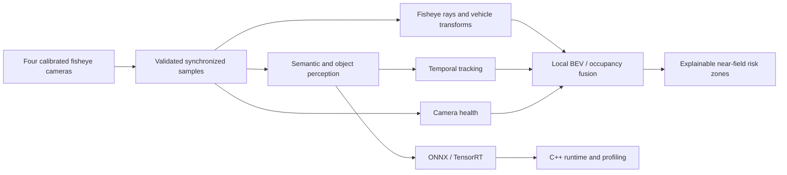

# NearField360

**Real-Time Multi-Camera Surround-View Perception for Automated Parking**

[](https://github.com/Mohamed-ahmed-shokry/nearfield360/actions/workflows/ci.yml)
[](https://www.python.org/)
[](LICENSE)

NearField360 is an engineering-focused computer vision system for calibrated automotive
fisheye cameras. Its target pipeline combines semantic perception, dynamic-object tracking,
camera-health awareness, and transparent geometric fusion into a local bird's-eye-view
representation around a vehicle.

The repository provides a reproducible, tested foundation: a WoodScape data layer, explicit
fisheye/vehicle geometry with ground-plane and BEV scaffolding, label-space perception
metrics, and inspection CLIs. Accuracy, latency, and FPS are deliberately not reported until
the corresponding experiments have run.

## Capability status

| Area | Status | Evidence |
| --- | --- | --- |
| Reproducible Python package | Implemented | Locked uv environment; wheel and sdist isolated-install smokes |
| Typed configuration and logging | Implemented | Strict validation, environment overrides, human/JSON logs; geometry and BEV sections |
| CLI and environment diagnostics | Implemented | `config validate`, `config show`, `doctor`, `geometry`, and `data` commands |
| Automated quality gates | Implemented | Ruff, strict mypy, pytest coverage, pre-commit, cross-platform CI |
| WoodScape data layer | Implemented core | Discovery, bounded readers, semantic/calibration/detection contracts, integrity, statistics, explicit-group splits, semantic overlays; synthetic tests |
| Fisheye calibration and geometry | Implemented core | Fourth-order radial projection/inverse, rigid transforms, vehicle cameras, surround rig, ground intersection, BEV grid; synthetic tests |
| Segmentation and detection metrics | Implemented foundation | Numpy-only confusion/IoU and XYXY box IoU without models or accelerators |
| Segmentation, detection, and tracking models | Planned | No model weights or training runs yet; no results reported |
| Camera health, BEV fusion, and risk layer | Planned | Grid scaffolding exists; no occupancy belief, uncertainty, or safety zones yet |
| ONNX, TensorRT, and C++ runtime | Planned | Optional native toolchains are not assumed to be installed |

## System design



The design keeps raw fisheye imagery whenever possible. It does not assume that rectilinear
undistortion can preserve a field of view greater than 180 degrees, and it does not infer metric
3D structure without a documented geometric or learned assumption.

Vehicle axes are X forward, Y left, and Z up. Camera axes are X right, Y down, and Z forward.
The ground plane is `Z == ground_z` (default zero). Pixels alone never determine depth: the
geometry layer returns unit rays and, with an explicit ground assumption, footprints with
Euclidean distances. Rays without a forward intersection stay unknown. The BEV grid covers
`[x_min, x_max) x [y_min, y_max)` with square cells and half-open bounds, matching the
fisheye image-bounds convention.

## Quick start

[uv](https://docs.astral.sh/uv/) is the supported environment manager. The project pins Python
3.12 for development and CI also verifies Python 3.11 and 3.13.

```powershell
git clone git@github.com:Mohamed-ahmed-shokry/nearfield360.git
Set-Location nearfield360
uv sync --locked --group dev
uv run nearfield360 --version
uv run nearfield360 doctor
```

The same commands work in POSIX shells after replacing `Set-Location` with `cd`.

### Configuration

Validate the repository defaults and inspect the effective settings:

```powershell
uv run nearfield360 --config configs/default.yaml config validate
uv run nearfield360 config show
```

Environment variables use the `NEARFIELD360_` prefix and `__` for nested fields. Environment
values override YAML values:

```powershell
$env:NEARFIELD360_PATHS__DATASET_ROOT = "D:\datasets\woodscape"
$env:NEARFIELD360_GEOMETRY__THETA_MAX = "2.2"
$env:NEARFIELD360_BEV__RESOLUTION = "0.05"
uv run nearfield360 config show
```

`configs/default.yaml` documents the geometry angular limit (`geometry.theta_max`), the ground
plane (`geometry.ground_z`), the footprint range gate (`geometry.max_distance`), and the local
BEV extent (`bev.x_min/x_max/y_min/y_max/resolution`). Older configuration files without the
`geometry` and `bev` sections continue to load with these defaults.

Relative paths are interpreted from the process working directory. Dataset presence is not
required for `--help`, `--version`, configuration validation, or the test suite.

### Geometry inspection

Validate a per-image calibration and map pixels to ground footprints without inferring depth:

```powershell
uv run nearfield360 geometry info --calibration D:\datasets\woodscape\calibration_data\00001_FV.json --json
uv run nearfield360 geometry ground --calibration D:\datasets\woodscape\calibration_data\00001_FV.json --pixel 640,480 --pixel 800,480 --json
uv run nearfield360 geometry bev --json
```

`--theta-max` overrides the configured angular limit; `--check-bounds/--ignore-bounds` toggles
the half-open image rectangle. Invalid rays and intersections behind the ray origin report as
unknown rather than extrapolated footprints.

## Dataset policy

[WoodScape](https://github.com/valeoai/WoodScape) is the primary target dataset because it
provides four automotive surround-view cameras and annotations for complementary perception
tasks. Its official repository labels the **data license as proprietary** even though its tools
have a separate open-source license. Download and accept the dataset terms through Valeo's
official channel; do not add WoodScape images, annotations, or calibration bundles to this
repository.

Inspect an already acquired dataset without changing its files:

```powershell
uv run nearfield360 data verify --root D:\datasets\woodscape --require-semantic --require-calibration
uv run nearfield360 data stats --root D:\datasets\woodscape --semantic --json
```

`--root` overrides the configured dataset path. Verification exits with status 1 for integrity
errors and 2 for a missing/invalid root. Statistics decode RGB files, report actual file sizes and
resolutions, and optionally count pixels in available semantic masks. They are not model metrics.
Unit tests use small synthetic fixtures, so contributors and CI do not need restricted data.

Render inspection overlays for samples that have semantic masks (samples without masks are
skipped, not fabricated):

```powershell
uv run nearfield360 data viz --root D:\datasets\woodscape --output outputs/viz --max-images 20
```

Split generation can keep explicitly supplied recording/sequence groups together. Its default
groups equal filename identifiers only: those identifiers do **not** establish camera
synchronization or recording-level separation. Evaluation must document verified grouping
provenance; do not treat the fallback as a leakage-free benchmark split.

## Development checks

Run the same core gates used in CI:

```powershell
uv lock --check
uv sync --locked --group dev
uv run pre-commit run --all-files
uv run pytest -q --cov=nearfield360 --cov-report=term-missing
uv build --clear
uv run twine check dist/*
```

Tests that eventually require external datasets, a GPU, or long runtimes are marked separately;
the default suite remains CPU-only and synthetic. Current CI runs on Linux with Python 3.11,
3.12, and 3.13, and on Windows with Python 3.12.

## Reproducibility and results policy

- Configuration, seeds, commands, code revisions, and environment metadata accompany each
  meaningful experiment.
- Dataset files, credentials, large checkpoints, generated engines, and machine-local output are
  ignored by Git.
- Measured results must identify hardware, software versions, input resolution, precision,
  dataset split, warmup, and timing boundaries.
- Missing CUDA, TensorRT, native compiler, or proprietary-data evidence is reported as
  unavailable—not silently replaced with estimates.

## Roadmap

1. ~~WoodScape discovery, parsing, integrity checks, statistics, and visualization.~~ Done (core):
   discovery, bounded RGB/label readers, semantic/calibration/detection contracts, integrity,
   statistics, explicit-group splits with manifests, and semantic overlay rendering.
2. ~~Fourth-order fisheye projection/inverse projection and camera-to-vehicle transforms.~~ Done
   (core): radial-polynomial projection/inverse, rigid transforms, calibrated cameras, surround
   rig, ground-plane intersection, and BEV grid scaffolding with geometry CLIs.
3. Deployment-oriented semantic segmentation, metrics, and reproducible experiments. In progress
   (foundation): numpy-only confusion/IoU and box-IoU metrics exist; no models, training, or
   measured scores yet.
4. Object detection, temporal tracking, and camera-soiling awareness. Next: detection parsing
   exists; tracking and soiling are unstarted.
5. Multi-camera BEV fusion, uncertainty propagation, and transparent safety zones. Next: grid
   scaffolding exists; occupancy belief and uncertainty are unstarted.
6. Controlled robustness evaluation and automated plots.
7. ONNX parity, optional TensorRT benchmarking, and a modular C++ runtime.
8. Integrated four-camera demo, measured performance report, and release audit.

## License

NearField360 source code is licensed under the [Apache License 2.0](LICENSE). External datasets,
pretrained weights, and third-party components remain subject to their own licenses.
