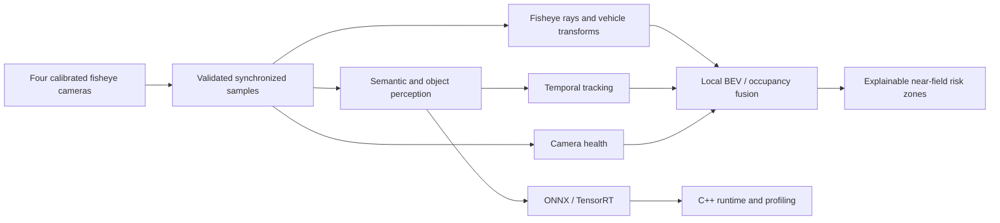

# NearField360

**Real-Time Multi-Camera Surround-View Perception for Automated Parking**

[](https://github.com/Mohamed-ahmed-shokry/nearfield360/actions/workflows/ci.yml)
[](https://www.python.org/)
[](LICENSE)

NearField360 is an engineering-focused computer vision system for calibrated automotive
fisheye cameras. Its target pipeline combines semantic perception, dynamic-object tracking,
camera-health awareness, and transparent geometric fusion into a local bird's-eye-view
representation around a vehicle.

The project is under active construction. The repository currently provides the reproducible,
tested foundation on which the data and perception components are being built. Accuracy,
latency, and FPS are deliberately not reported until the corresponding experiments have run.

## Capability status

| Area | Status | Evidence |
| --- | --- | --- |
| Reproducible Python package | Implemented | Locked uv environment; wheel and sdist isolated-install smokes |
| Typed configuration and logging | Implemented | Strict validation, environment overrides, human/JSON logs |
| CLI and environment diagnostics | Implemented | `config validate`, `config show`, and `doctor` commands |
| Automated quality gates | Implemented | Ruff, strict mypy, pytest coverage, pre-commit, cross-platform CI |
| WoodScape data layer | In progress | Synthetic-fixture implementation is the next delivery milestone |
| Fisheye calibration and geometry | Planned | WoodScape fourth-order radial polynomial model selected |
| Segmentation, detection, and tracking | Planned | No model results reported yet |
| Camera health, BEV fusion, and risk layer | Planned | No system results reported yet |
| ONNX, TensorRT, and C++ runtime | Planned | Optional native toolchains are not assumed to be installed |

## System design



The design keeps raw fisheye imagery whenever possible. It does not assume that rectilinear
undistortion can preserve a field of view greater than 180 degrees, and it does not infer metric
3D structure without a documented geometric or learned assumption.

## Quick start

[uv](https://docs.astral.sh/uv/) is the supported environment manager. The project pins Python
3.12 for development and CI also verifies Python 3.11 and 3.13.

```powershell
git clone git@github.com:Mohamed-ahmed-shokry/nearfield360.git
Set-Location nearfield360
uv sync --locked --group dev
uv run nearfield360 --version
uv run nearfield360 doctor
```

The same commands work in POSIX shells after replacing `Set-Location` with `cd`.

### Configuration

Validate the repository defaults and inspect the effective settings:

```powershell
uv run nearfield360 --config configs/default.yaml config validate
uv run nearfield360 config show
```

Environment variables use the `NEARFIELD360_` prefix and `__` for nested fields. Environment
values override YAML values:

```powershell
$env:NEARFIELD360_PATHS__DATASET_ROOT = "D:\datasets\woodscape"
uv run nearfield360 config show
```

Relative paths are interpreted from the process working directory. Dataset presence is not
required for `--help`, `--version`, configuration validation, or the test suite.

## Dataset policy

[WoodScape](https://github.com/valeoai/WoodScape) is the primary target dataset because it
provides four automotive surround-view cameras and annotations for complementary perception
tasks. Its official repository labels the **data license as proprietary** even though its tools
have a separate open-source license. Download and accept the dataset terms through Valeo's
official channel; do not add WoodScape images, annotations, or calibration bundles to this
repository.

NearField360 will provide discovery and validation tools for a local dataset root. Unit tests use
small synthetic fixtures, so contributors and CI do not need access to restricted data.

## Development checks

Run the same core gates used in CI:

```powershell
uv lock --check
uv sync --locked --group dev
uv run pre-commit run --all-files
uv run pytest -q --cov=nearfield360 --cov-report=term-missing
uv build --clear
uv run twine check dist/*
```

Tests that eventually require external datasets, a GPU, or long runtimes are marked separately;
the default suite remains CPU-only and synthetic. Current CI runs on Linux with Python 3.11,
3.12, and 3.13, and on Windows with Python 3.12.

## Reproducibility and results policy

- Configuration, seeds, commands, code revisions, and environment metadata accompany each
  meaningful experiment.
- Dataset files, credentials, large checkpoints, generated engines, and machine-local output are
  ignored by Git.
- Measured results must identify hardware, software versions, input resolution, precision,
  dataset split, warmup, and timing boundaries.
- Missing CUDA, TensorRT, native compiler, or proprietary-data evidence is reported as
  unavailable—not silently replaced with estimates.

## Scope and safety limitations

NearField360 is a research and portfolio project, not a certified ADAS component or vehicle
controller. Its future collision-risk layer will be an explainable geometric visualization, not a
planning system or a safety guarantee. Monocular images also leave regions occluded or
geometrically ambiguous; those regions must remain unknown rather than being presented as
observed free space.

## Roadmap

1. WoodScape discovery, parsing, integrity checks, statistics, and visualization.
2. Fourth-order fisheye projection/inverse projection and camera-to-vehicle transforms.
3. Deployment-oriented semantic segmentation, metrics, and reproducible experiments.
4. Object detection, temporal tracking, and camera-soiling awareness.
5. Multi-camera BEV fusion, uncertainty propagation, and transparent safety zones.
6. Controlled robustness evaluation and automated plots.
7. ONNX parity, optional TensorRT benchmarking, and a modular C++ runtime.
8. Integrated four-camera demo, measured performance report, and release audit.

## License

NearField360 source code is licensed under the [Apache License 2.0](LICENSE). External datasets,
pretrained weights, and third-party components remain subject to their own licenses.
